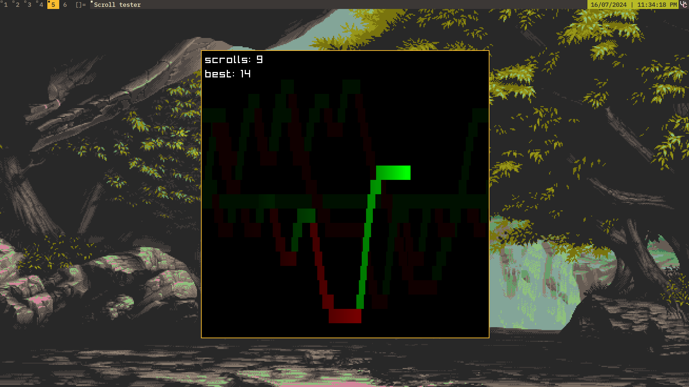

# Scroll tester
A simple scroll testing application that collects scrolls in the background. Heavily inspired by https://fractalglider.github.io/fun/2018/02/13/testing-mouse-scroll-wheel.html.


## Installation
### Pre-compiled binary for windows
Head to releases and download the latest release.

### Building


```bash
git clone https://github.com/redpz/scroll-tester
cd scroll-tester
cargo build -r
# the source code will be in scroll-tester/target/release/scroll-tester
```

> [!NOTE]
> This will require you to have the raylib library installed.

## Wayland
This won't work on wayland because this app is designed to be ran in the background and collect scrolls even without the window having focus. Wayland however doesn't allow for collecting global input to any app except your compositor.
